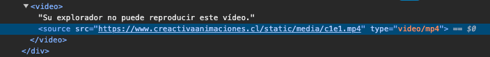

# creactiva
Repositorio aplicación web Creactiva Animaciones

admin
creactiva

javier@creactiva.cl
usuario1

próximos pasos:

App cursos:
    ✔ sistema de permisos: bloque if else para manejar permisos de visualización en template
    ✔ insertar c1e1_player en base.html: ahora será un html aparte exclusivo para servir los videos
    ✔ curso: público, capítulo: privado
    - problema: ¿cómo restringir el acceso a los links de los mp4 que están alojados en el hosting?
    - ¿qué necesita un capítulo? *diferenciarlo de los archivos necesarios para el reproductor, que son todos el mismo
        - config.xml: img/1.png
        - config_xml.js: scripts/config_xml.js // Ojo, en este se deben configurar más links, pero todavía no puedo hacerlo desde el backend, se debe hacer manual
        - thumbnails.png: c1e1_Thumbnails.png
        - first_frame.png: img/1.png
        - mp4: https://www.creactivaanimaciones.cl/static/media/c1e1.mp4
    Tareas app cursos:
        - armar el estilo de la vista general de un curso
            - botón conoce más (que redirige más abajo)
            - elemento ul desplegable para navegar por capítulos
        - armar el estilo de un capítulo
            - botón ver más que redirige más abajo
        - que josé suba todos los caps de los dos cursos y yo los linkeo a la rama dev

    ✔ ejecución asíncrona del script reproductor.js que corrige el estilo del smart player

App principal, control de permisos:
    ✔ sección login/registro
    ✔ primera restricción de permisos: invitado/usuario (usuarios no logueados no pueden acceder al contenido)
    - segunda restricción de permisos: usuario/cliente
    - registrar formulario contacto en bbdd (aprovechar el vuelo con formulario plan organización)

App suscripciones:
    ✔ templates básicos: eleccion_plan.html, plan_individual.html, plan_organizacion.html
    - elementos de cada template básico.
    - registrar formularios: plan organización.
    - crear modelos: ¿Cuáles?
    Prueba planes:
        - ususario: id = 101 no se le muestra nada//  Javier
        - usuario: id = 111 se le muestra el contenido // José

App usuarios:
    - templates básicos: panel_organizacion.html, panel_individual.html, panel_admin.html
    - ver si queda mejor la estructura de 3 html distintos o si es mejor 1 solo html con bloques
    if elif según tipo de usuario.

Apuntes configuración de un capítulo:
- smart player:
    - servir min.css desde django, editar el aspecto del reproductor desde este archivo
    - servir min.js desde cdn de techsmith
    - servir thumbnail desde hosting creactiva (porque lo necesita el js y no sirven las rutas que ofrece
    django)
    - video: no funciona servido desde django, tiene que ser servido desde afuera, si no, ocurre el error
    de que no funciona la barra de progreso
    - config_xml.js llega desde local, thumbnail servido desde hosting
    - XXXX_config.xml servido desde local, thumbnail y first frame pueden ser servidos desde django, cap
    desde hosting
    - first frame servido desde django

Investigación:
- Problema: ¿cómo hacer para que el link no sea visible de esta manera?

    - Desarrollo: ¿por quién es realmente visible? Por la persona a la que la app django le da acceso pues.
    - Vulnerabilidad: la persona podría tomar el link del video mirando el código con las herramientas de 
    desarrollador, copiarlo y compartirlo.
    - Solución 1: Agregar una capa de seguridad desde el servidor donde se estén almacenando los videos. El
    tema será que para que django pueda acceder a esos videos también debo agregarle un sistema de auten-
    tificación. Lo bueno, es que eso solucionaría 100% el problema.
    - Solución 2: Buscar una funcionalidad django que permita servir videos ?? pero eso significaría perder
    el smart player y descartar camtasia xd.
    - Respuestas: 
        Me da la impresión de que servir los videos a partir de un iframe soluciona el problema (no, porque
        desde el iframe se puede ver el html que está sirviendo)
        Me da la impresión de que esto es una limitación de SSR (en parte, porque el código del smart player
        se renderiza desde el navegador) -> ¿y si lo integro con react?
        
- Problema: Servir js minificados desde el servidor que requieren un mapeo. No solo pasa con smartplayer,
            también pasa con jquery. Quizás por ahí podría encontrar solución al problema en general.
    - Solución 1: Se puede descargar el archivo map de jqery acá: https://www.cdnpkg.com/jquery/1.11.3
    ¿Servirá servir este archivo? ¿Cómo se puede linkear

DEBUG APP CAPÍTULOS:
    - botón comenzar: si el curso no está iniciado, entonces partir desde el capítulo 1. Si el curso está
    iniciado, entonces partir desde el último punto (y cambiar el texto a "continuar").
    - botón comenzar: envía al backend la señal de que el curso fue iniciado.
    - mejorar renderización del script de corrección del estilo del reproductor.
    - terminar la función que recupera el momento de reproducción T_T.

DEBUG NAVEGACIÓN: RESUELTO
    SOLUCIÓN: manejo de diferentes casos con bloques if elif en snippet
    ✔ hay que ver bien dónde nos va a llevar la pestaña "capítulos" del navbar. Hasta ahora lleva al index.
    ✔ implementar botón "back" sin necesidad de repetir el snippet para cada template
